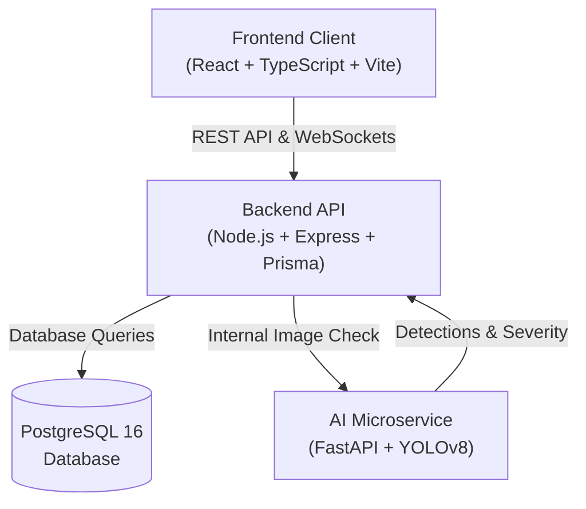
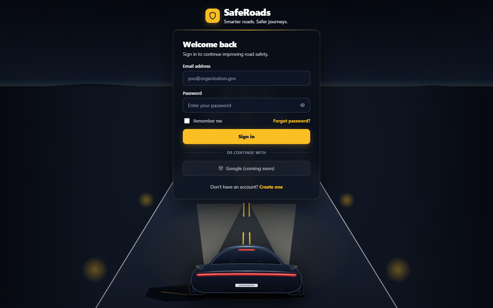
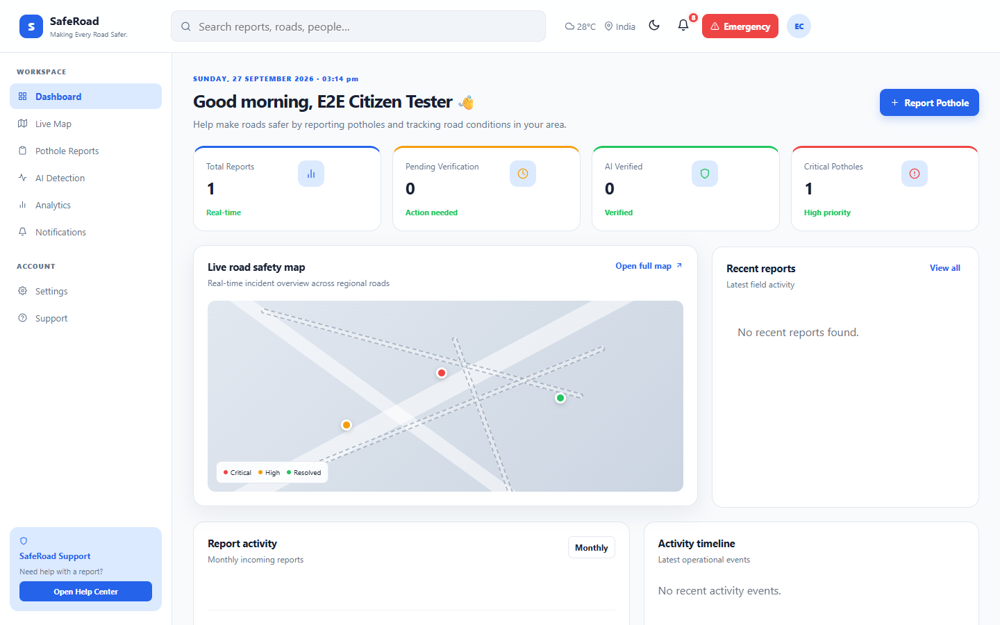
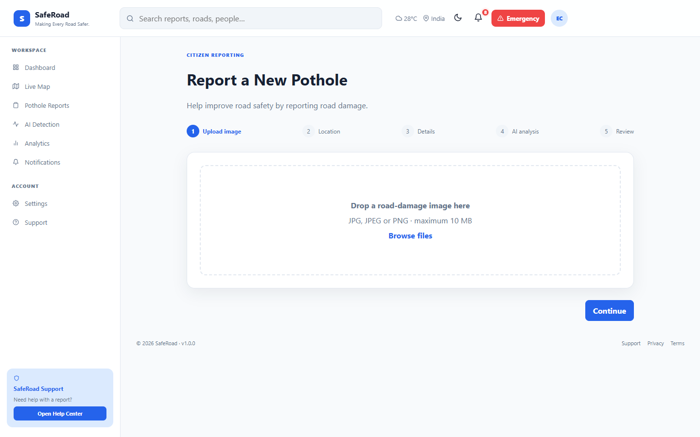
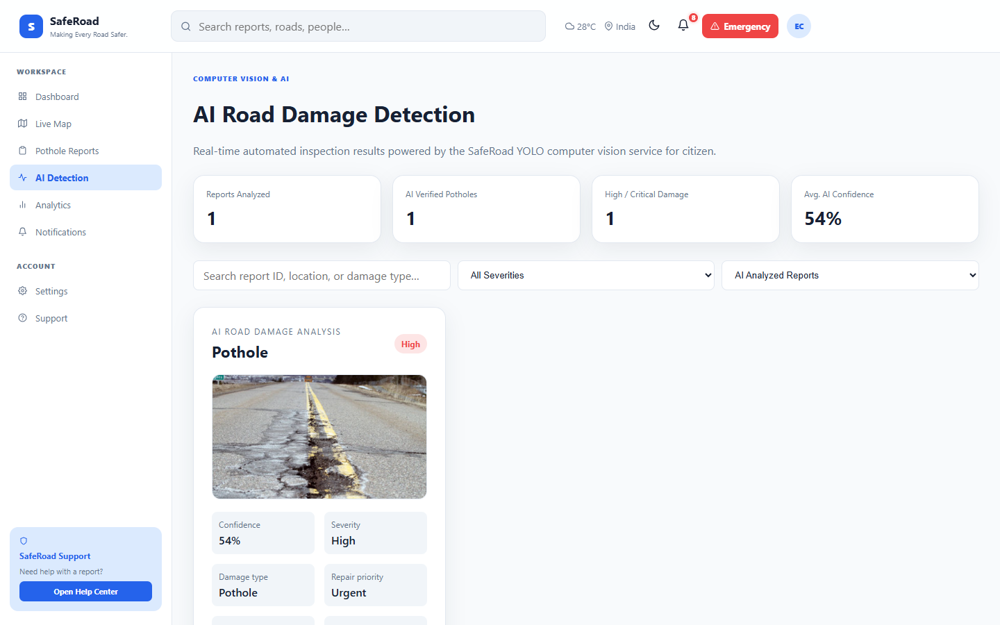
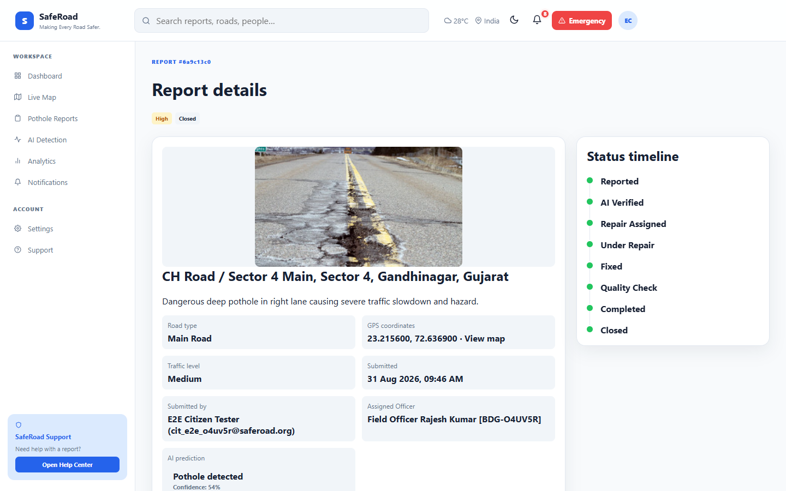
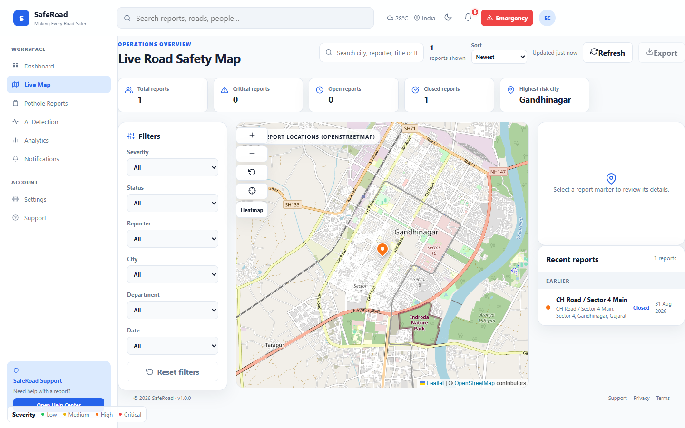
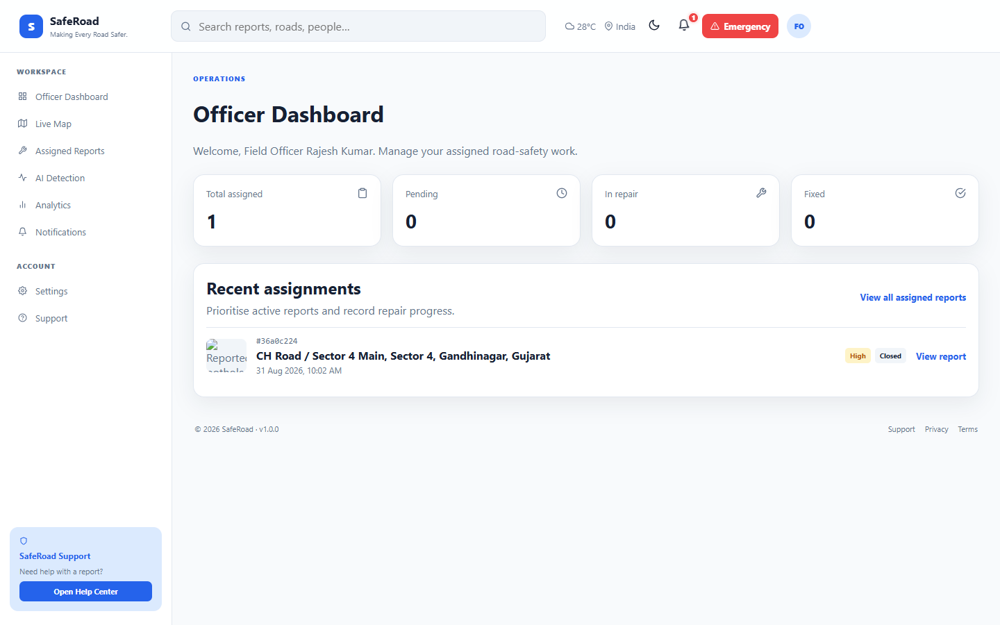
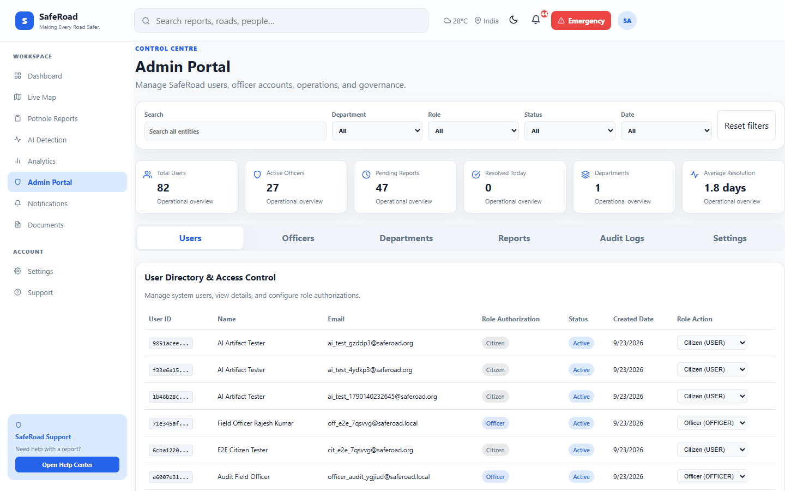

# 🛣️ SafeRoads

An intelligent road safety and municipal repair tracking platform powered by computer vision.

> What if reporting a pothole was as easy as taking a photo?

Potholes and broken roads cause accidents, damage vehicles, and make daily commutes dangerous. For most citizens, reporting road damage is slow, frustrating, or confusing. People often do not know who to contact, and complaints get lost in paperwork.

SafeRoads makes road maintenance simple and transparent. When a citizen sees a pothole, they snap a photo and submit it with their location. Our built-in AI scans the photo to detect road damage and calculate its severity.

Municipal teams and city officers can immediately view incoming issues on an interactive map, assign field crews, track repairs step by step, and keep citizens informed until the road is fixed.

---

## 🌍 The Problem

* **Dangerous roads**: Unrepaired potholes cause vehicle accidents and costly tire and suspension damage every day.
* **Slow reporting**: Traditional municipal complaint systems are hard to use, lack photo verification, and take weeks to process.
* **No visibility**: Citizens rarely receive updates after reporting a road hazard, making it impossible to know if anyone is working on the problem.
* **Unclear prioritization**: City maintenance teams struggle to decide which road repairs are urgent without clear visual data.

---

## 💡 The Idea

SafeRoads connects everyday citizens directly with city maintenance workers through a simple, visual, and automated workflow:

```text
Citizen
   ↓
Upload Photo
   ↓
Add Location & Details
   ↓
AI Checks Image
   ↓
Report Created
   ↓
Officer Handles Report
   ↓
Citizen & Admin Track Progress
```

---

## ✨ Key Features

* **Citizen registration and login**: Secure account creation with email and password.
* **Pothole photo upload**: Snap or upload a photo directly from your device.
* **Location & GPS support**: Automatically pick your current GPS location or choose a spot on an interactive map.
* **AI pothole detection**: Automated image verification using a trained YOLOv8 model.
* **AI confidence and severity ratings**: Instant estimation of damage severity (Low, Medium, or High) and model confidence.
* **Report status tracking**: Follow a report from initial submission to final repair completion.
* **Officer assignment**: City administrators can assign specific road repairs to field officers.
* **Officer repair workflow**: Officers update progress in real time as work happens on the ground.
* **Admin management**: Full dashboard to view all city reports, monitor reports and manage officers.
* **Discussion comments**: Citizens and officers can post updates and questions directly on individual reports.
* **Real-time notifications**: Live updates powered by WebSockets so users see changes instantly.
* **Interactive map and dashboard**: Visual map markers showing road issues across the city by status and severity.
* **Role-based access control**: Citizens, officers, and administrators each see only the tools and data meant for them.

---

## 👥 User Roles

| User | What they can do |
| :--- | :--- |
| **Citizen** | Report road damage, upload photos, set locations, and track report status. |
| **Municipal Officer** | View assigned repair tasks, inspect AI findings, and update repair progress. |
| **Admin** | Oversee all city reports, assign work to officers, view system information and manage officers. |

---

## 🔄 Report Lifecycle

Every report moves through an organized, transparent lifecycle from start to finish:

```text
Reported → AI Verified → Officer Assigned → In Progress → Fixed → Quality Check → Completed → Closed
```

1. **Reported**: The citizen submits the road photo with location and description.
2. **AI Verified**: The AI microservice scans the image, confirms the pothole, and scores its severity.
3. **Officer Assigned**: A municipal supervisor reviews the issue and assigns a local field officer.
4. **In Progress**: The repair crew arrives on site and starts fixing the damaged road.
5. **Fixed**: The repair team completes road work and marks the physical repairs as finished.
6. **Quality Check**: An officer or supervisor reviews the finished repair to ensure quality standards.
7. **Completed**: The report is formally approved as fully restored.
8. **Closed**: The ticket is archived with a full history of all actions, dates, and comments.

---

## 🤖 How AI Works

You do not need to understand machine learning to see how SafeRoads works:

1. **Image Upload**: When a citizen submits a report, the backend securely receives the image file.
2. **AI Inspection**: The backend forwards the image to an internal AI service running a custom YOLOv8 computer vision model.
3. **Object Detection**: The AI checks the photo for road damage. If potholes are found, it generates bounding-box coordinates and confidence scores.
4. **Severity Rating**: The service calculates damage severity (Low, Medium, or High) based on the relative size of the pothole.
5. **Automatic Storage**: The detection results, confidence score, and annotated image are saved directly with the report.
6. **Custom Weights Requirement**: The system strictly requires our trained model weights (`ai-service/models/best.pt`) to run. If weights are missing, it safely reports an error instead of guessing with generic labels.

---

## 🏗️ How SafeRoads Works

SafeRoads uses separate frontend, backend, database, and AI services that work together smoothly:



* **Frontend**: The web interface used in browsers by citizens, officers, and admins.
* **Backend**: The central API that manages user accounts, data storage, permissions, and report workflows.
* **Database**: Reliable PostgreSQL database storing user profiles, reports, comments, and AI findings.
* **AI Service**: An internal microservice that runs computer vision inference. In Docker, it communicates privately with the backend without being exposed directly to the public internet.

---

## 🛠️ Technology Used

| Part | Technology | Purpose |
| :--- | :--- | :--- |
| **Frontend** | React 19, TypeScript, Vite | Modern, responsive web user interface |
| **Styling** | Tailwind CSS | Clean, modern design system |
| **Backend** | Node.js, Express, TypeScript | REST API and business logic |
| **Database** | PostgreSQL 16, Prisma ORM | Relational data storage and migrations |
| **AI Service** | Python 3.11+, FastAPI, YOLOv8, OpenCV | Automated computer vision damage detection |
| **Maps** | OpenStreetMap, React Leaflet | Interactive geographic maps and GPS plotting |
| **Authentication** | JWT, HTTP-only cookies | Secure user sessions and role protection |
| **Real-time updates** | Socket.IO | Live dashboard and notification updates |
| **Containers** | Docker, Docker Compose | Easy local deployment and service isolation |

---

## 🔐 Security

SafeRoads was built with security and data privacy in mind:

* **JWT with HTTP-only Cookies**: Authentication tokens are stored in protected HTTP-only cookies to help protect against Cross-Site Scripting (XSS).
* **Role-Based Access Control (RBAC)**: Strict permission checks guarantee that citizens cannot access officer or administrative operations.
* **Protected File Attachments**: Uploaded images are never served through an open static folder. Images are only delivered through an authenticated route that verifies view permissions.
* **Internal AI Communication**: When deployed with Docker, the AI service does not publish ports to the public host. It only communicates internally with the backend.
* **Service-to-Service API Key**: Every request from the backend to the AI service requires a shared internal API key verified with constant-time matching.
* **HTTP Security Headers**: Powered by Helmet to prevent common browser-level security vulnerabilities.
* **CORS Protection**: Access is restricted strictly to approved frontend origins.
* **Safe Secret Handling**: All database passwords and security tokens are loaded through environment variables and kept out of version control.

---

## 📸 Screenshots

### Authentication & Login


### Citizen Dashboard


### Report a Pothole


### AI Road Damage Detection


### Report Details & Lifecycle


### Interactive Live Map


### Municipal Officer Dashboard


### Administrator Portal


---

## 🚀 Quick Start with Docker

The fastest way to run the complete SafeRoads system locally is using Docker Compose:

```bash
# 1. Copy the example environment file
cp .env.example .env

# 2. Open .env and set your secrets
# Configure: POSTGRES_PASSWORD, JWT_SECRET, and AI_INTERNAL_API_KEY

# 3. Build and launch all services
docker compose up --build
```

> **Security Note:** Always set strong, unique values for `POSTGRES_PASSWORD`, `JWT_SECRET`, and `AI_INTERNAL_API_KEY` in `.env`. Never commit your filled `.env` file.

### Service Endpoints

Once running, access the following URLs in your web browser:

| Service | Local URL | Description |
| :--- | :--- | :--- |
| **Frontend Web App** | `http://localhost:5173` | Citizen and officer web portal |
| **Backend API** | `http://localhost:8000` | REST API base |
| **Backend Health** | `http://localhost:8000/health` | Backend status check endpoint |

*Note: For security reasons, the AI microservice (port 8001) and the PostgreSQL database (port 5432) do not publish ports to your host machine. They communicate privately across the internal Docker network.*

---

## 💻 Local Development Without Docker

If you prefer to run the services individually on your computer without Docker:

### 1. Prerequisites
* **Node.js** (v20+)
* **Python** (v3.11+)
* **PostgreSQL** (v16)

### 2. Database & Backend
```bash
cd backend
npm install
cp .env.example .env
# Set DATABASE_URL, JWT_SECRET, and AI_INTERNAL_API_KEY in .env
npx prisma db push
npm run dev
```

### 3. AI Service
```bash
cd ai-service
python -m venv venv
# Windows: venv\Scripts\activate | Linux/macOS: source venv/bin/activate
pip install -r requirements.txt
cp .env.example .env
# Set AI_INTERNAL_API_KEY in .env (must match backend's AI_INTERNAL_API_KEY)
uvicorn main:app --host 0.0.0.0 --port 8001 --reload
```

### 4. Frontend
```bash
cd frontend
npm install
cp .env.example .env
npm run dev
```

---

## 🧪 Testing

SafeRoads includes comprehensive automated test suites to ensure code quality and stability.

### Verified Test Results

* **Backend Unit & Integration Suite**: **41/41 passed**
* **API End-to-End Suite**: **34/35 checks passed** (1 host-only AI health check is expected to fail because port 8001 is not published from Docker)
* **Browser End-to-End Suite**: **69/69 passed**
* **Frontend Production Build**: **Passed**

### Running the Tests

**Backend Tests:**
```bash
cd backend
npm test
```

**Frontend Build & Typecheck:**
```bash
cd frontend
npm run build
```

**AI Microservice Tests:**
```bash
cd ai-service
python -m unittest discover tests
```

**Browser End-to-End Suite:**
```bash
node browser_e2e_test.js
```

**API End-to-End Suite:**
```bash
node audit_e2e_test.js
```

---

## 🧠 AI Model

SafeRoads requires a custom-trained YOLOv8 model located at:

```text
ai-service/models/best.pt
```

The AI microservice strictly verifies this custom model file on startup. If the model file is missing or corrupted, the service reports itself as unhealthy and safely rejects detection requests rather than falling back to generic pre-trained weights.

### Optional: Model Training Guide

If you want to train your own custom pothole detection model:

1. Download a dataset formatted for **YOLOv8 PyTorch** (such as from Roboflow Universe).
2. Extract the dataset into `ai-service/dataset/` so that `dataset/data.yaml` is present.
3. Run the automated training script:
   ```bash
   cd ai-service
   python scripts/train_pothole_yolo.py
   ```
4. The script trains the model for 50 epochs and copies the resulting weights to `ai-service/models/best.pt`.

---

## 📁 Project Structure

Here is a simple map of the folders and key files in the repository:

```text
SafeRoad/
├── frontend/                     # React web application
│   └── src/
│       ├── components/          # Reusable UI elements (buttons, cards, navbars)
│       ├── pages/               # Main screens (Dashboard, Report, Details, Login)
│       ├── context/             # App state (Auth context, theme, user session)
│       ├── services/            # API call helpers to talk with the backend
│       └── hooks/               # Custom React helpers and utilities
│
├── backend/                      # Node.js + Express REST API
│   ├── src/
│   │   ├── controllers/         # Request handlers for reports, users, auth
│   │   ├── routes/              # API URL endpoints (/api/reports, /api/auth)
│   │   ├── services/            # Business logic and AI service integration
│   │   ├── middleware/          # Security checks, auth validation, file upload
│   │   ├── prisma/              # Database schema and seed data
│   │   └── socket/              # Real-time WebSocket event handlers
│   └── tests/                   # Backend automated integration tests
│
├── ai-service/                   # FastAPI computer vision microservice
│   ├── app/
│   │   ├── api/                 # Detection API endpoints
│   │   ├── core/                # YOLOv8 model loader and configuration
│   │   ├── services/            # Image processing and inference logic
│   │   └── schemas/             # Request and response data structures
│   ├── models/
│   │   └── best.pt              # Custom trained YOLOv8 model weights
│   ├── scripts/                 # Training and evaluation scripts
│   └── tests/                   # AI service test suite
│
├── docs/                         # Architecture guides and documentation
├── docker-compose.yml            # Multi-service container setup
├── browser_e2e_test.js           # End-to-end browser test script
├── audit_e2e_test.js             # End-to-end API verification script
└── README.md                     # Project overview and setup guide
```

---

## 🔮 Future Scope

The following capabilities are ideas planned for future releases:

* **Offline Mode**: Local caching on mobile browsers so citizens in remote areas with poor connectivity can save reports and sync later.
* **Spatial Heatmap Analytics**: Advanced density clustering algorithms to help city councils plan road resurfacing budgets.
* **Automated Email & SMS Alerts**: Direct citizen notifications when repair crews begin or complete road repairs.

---

## 📄 License

This project is open-source and licensed under the **[MIT License](LICENSE)**.
