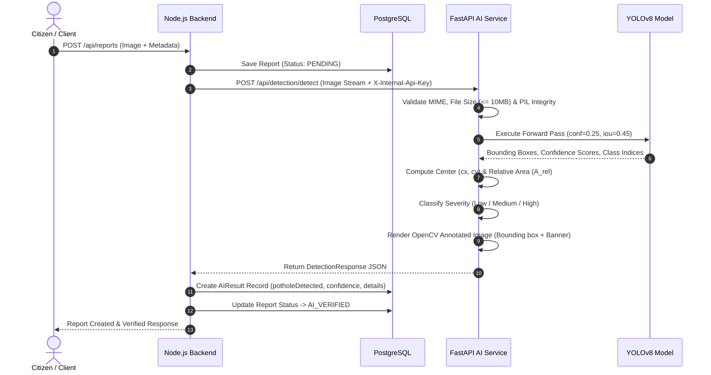
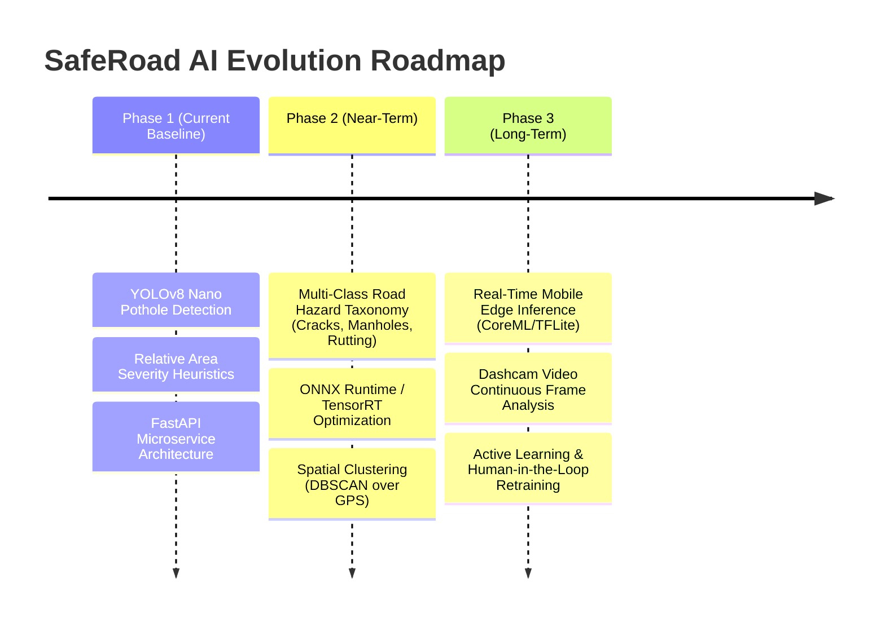

# SafeRoad AI Architecture Specification 🛣️🤖

This document provides a comprehensive technical architecture of the **Artificial Intelligence & Computer Vision subsystem** in SafeRoad. It covers the model topology, real-time inference pipeline, severity estimation heuristics, backend integration, training lifecycle, and future evolution roadmap.

---

## 1. System Context & Architectural Topology

The SafeRoad AI subsystem is architected as an independent, stateless microservice that decouples heavy deep-learning inference workloads from the core business logic and relational database operations.

```mermaid
flowchart TD
    subgraph ClientLayer ["Client Layer"]
        C1["Citizen Mobile / Web App"]
        C2["Municipal Officer Dashboard"]
    end

    subgraph BackendLayer ["Node.js / Express Core Backend"]
        API["REST & WebSocket Gateway"]
        Auth["JWT / RBAC Middleware"]
        ReportCtrl["Report Controller"]
        AIServiceClient["AI Service Client (aiService.ts)"]
        DB[(PostgreSQL 16 via Prisma)]
        Socket["Socket.io Event Emitter"]
    end

    subgraph AISubsystem ["SafeRoad AI Microservice (FastAPI :8001)"]
        FastAPIApp["FastAPI Ingestion Gateway"]
        SecurityMW["Internal API Key Guard (HMAC)"]
        ValLayer["Input Validation & Integrity Engine"]
        Loader["YOLOv8 Singleton Model Loader"]
        InferenceEngine["YOLOv8 PyTorch Inference Core"]
        SeverityEngine["Heuristic Severity & Surface Calculator"]
        Visualizer["OpenCV Annotation & Drawing Engine"]
        Storage["Static Output Assets (/uploads)"]
    end

    C1 -->|1. Submit Report Image + GPS| API
    API --> Auth --> ReportCtrl
    ReportCtrl -->|2. Persist Draft Report| DB
    ReportCtrl -->|3. Forward Image Buffer| AIServiceClient
    AIServiceClient -->|4. HTTP POST multipart/form-data with X-Internal-Api-Key| FastAPIApp
    
    FastAPIApp --> SecurityMW --> ValLayer
    ValLayer --> Loader --> InferenceEngine
    InferenceEngine --> SeverityEngine --> Visualizer
    Visualizer --> Storage
    
    AISubsystem -->|5. Structured Detection JSON Payload| AIServiceClient
    AIServiceClient -->|6. Store AIResult Record| DB
    AIServiceClient -->|7. Update Status to AI_VERIFIED| DB
    AIServiceClient -->|8. Dispatch Real-time Notification| Socket
    Socket -->|9. WebSocket Push (report:verified)| C2
```

---

## 2. Component Breakdown & Microservice Design

The AI microservice (`ai-service/`) is built using **FastAPI**, **Uvicorn**, **PyTorch**, **Ultralytics YOLOv8**, and **OpenCV**.

### 2.1 Layered Architecture

```
ai-service/
├── app/
│   ├── api/
│   │   └── detection.py         # FastAPI Route definitions & endpoint contracts
│   ├── core/
│   │   └── model_loader.py      # Singleton YOLO model lifecycle & fallback manager
│   ├── schemas/
│   │   └── detection.py         # Pydantic v2 data transfer objects (DTOs)
│   ├── services/
│   │   └── detection_service.py # Image validation, inference, OpenCV annotation, severity
│   └── utils/                   # Shared utility helpers
├── models/
│   ├── best.pt                  # Fine-tuned production pothole weights
│   └── yolov8n.pt               # Pretrained fallback baseline
├── scripts/
│   ├── train_pothole_yolo.py    # Local training script
│   ├── evaluate_pothole_model.py# Model metric evaluation (mAP, Precision, Recall)
│   └── fetch_pothole_dataset.py # Automated dataset acquisition
├── uploads/                     # Annotated image asset output cache
└── main.py                      # Application bootstrap, CORS, and static mount
```

---

## 3. End-to-End Image Processing & Detection Pipeline



### 3.1 Pipeline Execution Stages

1. **Ingestion & Sanitization**:
   - File extension verification (`.jpg`, `.jpeg`, `.png`, `.webp`).
   - MIME header validation (`image/jpeg`, `image/png`, `image/webp`).
   - Byte-stream payload limit ($10\text{ MB}$).
   - `PIL.Image.verify()` execution to catch truncated or corrupted binaries.

2. **Model Lifecycle & Lazy Loading**:
   - `YOLOModelLoader` implements a thread-safe singleton pattern.
   - Priority hierarchy:
     $$\text{Model Path Priority} = \text{models/best.pt (Fine-tuned)} \longrightarrow \text{yolov8n.pt (Stock Fallback)}$$
   - Ensures memory is allocated once at startup or on first request, avoiding per-request reloading overhead.

3. **Inference Execution**:
   - Ultralytics YOLOv8 object detection forward pass.
   - Confidence threshold: $\tau_{\text{conf}} = 0.25$ (tuned to minimize road texture false-positives).
   - Non-Maximum Suppression (NMS) IoU threshold: $\tau_{\text{iou}} = 0.45$.

4. **Severity Estimation Heuristic**:
   The severity of detected potholes is dynamically calculated based on their relative surface area footprint over the captured frame:
   $$A_{\text{box}} = (x_2 - x_1) \times (y_2 - y_1)$$
   $$A_{\text{image}} = W_{\text{image}} \times H_{\text{image}}$$
   $$R_{\text{area}} = \frac{A_{\text{box}}}{A_{\text{image}}}$$

   | Relative Area ($R_{\text{area}}$) | Severity Rating | Bounding Box Color (BGR) | Municipal Priority |
   | :--- | :--- | :--- | :--- |
   | $R_{\text{area}} < 2.0\%$ | **Low** | Green `(0, 255, 0)` | Routine Maintenance (P3) |
   | $2.0\% \le R_{\text{area}} < 5.0\%$ | **Medium** | Orange `(0, 165, 255)` | Scheduled Repair (P2) |
   | $R_{\text{area}} \ge 5.0\%$ | **High** | Red `(0, 0, 255)` | Immediate Dispatch (P1) |

5. **Visual Annotation & Asset Generation**:
   - Annotated bounding boxes, confidence tags, and severity labels are rendered directly onto the image using OpenCV.
   - Saved with unique UUID prefixes (`annotated_<uuid>.<ext>`) to avoid file collision and race conditions.
   - Served via FastAPI StaticFiles mount at `/uploads/*`.

---

## 4. Deep Learning Model Topology & Training Specifications

### 4.1 YOLOv8 Neural Network Topology

The vision core utilizes the **Ultralytics YOLOv8** architecture:

```
Input Image (640x640x3)
        │
┌───────▼────────────────────────────────────────────────────────┐
│ Backbone: Modified CSPDarknet53 + C2f Modules                  │
│ • Cross-Stage Partial Network with 2 convolutions (C2f)        │
│ • SPPF (Spatial Pyramid Pooling - Fast)                        │
│ • Feature maps extracted at P3 (80x80), P4 (40x40), P5 (20x20) │
└───────┬────────────────────────────────────────────────────────┘
        │
┌───────▼────────────────────────────────────────────────────────┐
│ Neck: Path Aggregation Network (PANet)                         │
│ • Top-down & bottom-up multi-scale feature fusion              │
│ • Rich semantic and spatial localization preservation          │
└───────┬────────────────────────────────────────────────────────┘
        │
┌───────▼────────────────────────────────────────────────────────┐
│ Head: Anchor-Free Decoupled Detection Head                     │
│ • Independent classification and regression branches           │
│ • Loss: CIoU (Complete IoU) + DFL (Distribution Focal Loss)    │
│ • Classification Loss: Binary Cross-Entropy (BCE)              │
└───────┬────────────────────────────────────────────────────────┘
        │
Output Detections: [B, N, 6] -> (x1, y1, x2, y2, confidence, class_id)
```

### 4.2 Training Hyperparameters & Data Augmentation

| Parameter | Configuration | Rationale |
| :--- | :--- | :--- |
| **Base Architecture** | YOLOv8 Nano (`yolov8n.pt`) / YOLOv8 Small (`yolov8s.pt`) | Low-latency CPU/GPU edge deployment |
| **Input Resolution** | $640 \times 640$ | Balances small pothole edge detection & FPS |
| **Batch Size** | 16 (Colab T4) / 32 (A100) | Gradient stability and convergence |
| **Epochs** | 50 – 100 | Early stopping with patience = 15 |
| **Optimizer** | AdamW / SGD ($\text{lr}_0 = 0.01, \text{lrf} = 0.01$) | Smooth decay schedule with cosine annealing |
| **Augmentations** | Mosaic (1.0), Mixup (0.1), HSV Jitter, Flips, Blur | Simulates diverse road surfaces, shadows & rain |

---

## 5. Backend Integration & Data Schema

### 5.1 Service-to-Service Security

All requests between the Node.js backend and FastAPI AI microservice are protected via an internal shared key:
- Header: `X-Internal-Api-Key`
- Verification: Constant-time digest comparison using `hmac.compare_digest()` to prevent timing side-channel attacks.

### 5.2 API Data Contracts

#### Request Contract (`POST /api/detection/detect`)
- **Content-Type**: `multipart/form-data`
- **Body**: `image: UploadFile`

#### Response Schema (`DetectionResponse`)
```json
{
  "success": true,
  "processing_time": 0.0842,
  "width": 1920,
  "height": 1080,
  "total_detections": 1,
  "detections": [
    {
      "class_name": "Pothole",
      "confidence": 0.8924,
      "box": [412.5, 620.0, 780.2, 890.4],
      "center": [596.35, 755.2],
      "severity": "High"
    }
  ],
  "annotated_image_path": "/uploads/annotated_3f8b91a2c.jpg",
  "error": null
}
```

### 5.3 Database Persistence Model (Prisma Schema)

```prisma
model AIResult {
  id              String   @id @default(uuid())
  reportId        String   @unique
  report          Report   @relation(fields: [reportId], references: [id], onDelete: Cascade)
  potholeDetected Boolean  @default(false)
  confidenceScore Float    @default(0.0)
  details         String?  // JSON string containing bounding boxes, severity, modelVersion
  createdAt       DateTime @default(now())
  updatedAt       DateTime @updatedAt

  @@index([reportId])
  @@index([potholeDetected])
}
```

---

## 6. Resilience, Error Handling & Fallbacks

1. **Circuit Breaking & Timeout Safeguards**:
   - Backend calls to the AI service are wrapped with an `AbortController` set to a **10-second timeout**.
   - If the AI service is unreachable or encounters an unhandled exception, the backend logs the error gracefully, keeps the report in `PENDING` status, and allows manual officer verification without blocking the user.

2. **Model Weight Fallback**:
   - If custom weights `models/best.pt` are missing on container initialization, the model loader automatically falls back to `yolov8n.pt` with a logged system warning.

3. **Disk & Storage Garbage Collection**:
   - Intermediate original image buffers are deleted immediately following inference.
   - Annotated files are stored under `/uploads` and can be paired with an automated cron cleanup or S3 bucket lifecycle policy.

---

## 7. Future AI Roadmap & Planned Upgrades



1. **Multi-Hazard Classification**:
   - Expand taxonomy to differentiate between:
     - `Pothole`
     - `Alligator Crack`
     - `Longitudinal / Transverse Crack`
     - `Manhole / Drainage Anomaly`
2. **Spatial Density Clustering**:
   - Apply **DBSCAN** or **HDBSCAN** geospatial clustering across report GPS coordinates to combine multiple citizen sightings of the same pothole into a single consolidated incident.
3. **Edge & Video Stream Inference**:
   - Export models to **ONNX**, **TensorRT**, and **TF-Lite** for dashcam streaming and on-device mobile detection without network roundtrips.
4. **Active Learning Feedback Loop**:
   - Feedback from municipal officers (marking false positives or correcting bounding boxes) is staged to retrain and continuously improve model precision over time.
